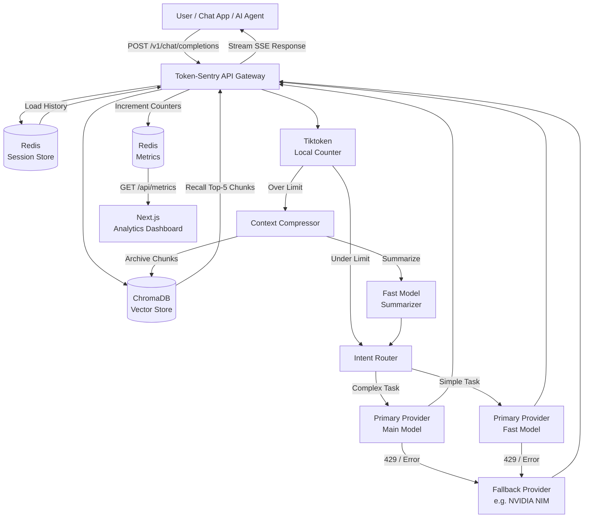

# 🛡️ Token-Sentry

**Token-Sentry** is an intelligent, production-grade API gateway for Large Language Models. It sits between your application and any LLM provider, automatically compressing conversation history, routing requests to the cheapest capable model, and silently failing over to a backup provider — all while being 100% compatible with the OpenAI SDK.

> **Works with any OpenAI-compatible provider:** Groq, NVIDIA NIM, OpenRouter, Together AI, Fireworks, Anthropic (via proxy), and OpenAI itself.

---

## ✨ Features

| Feature | What it does |
|---|---|
| 🗜️ **Context Compression** | When conversation history crosses the token watermark (default: 4,000), older messages are summarized by the fast model, chunked, and stored in ChromaDB — keeping your payload small |
| 🧠 **Infinite Vector Memory** | Archived messages are converted into vector embeddings (Sentence Transformers). On every new request, the top-5 semantically relevant chunks are recalled and injected back into context |
| 🚦 **Intent-Based Routing** | Simple queries ("Hello", "What is 2+2?") are automatically offloaded to the cheap fast model — saving the expensive 70B model for code, reasoning, and complex tasks |
| ⚡ **Provider Fallbacks** | If the primary provider (e.g. Groq) returns a rate-limit error, Token-Sentry catches it instantly and retries on the fallback (e.g. NVIDIA NIM) — with zero delay |
| 📊 **Analytics Dashboard** | A live Next.js dashboard showing tokens saved, cost saved, routing breakdown, provider health, and a real-time activity feed |
| 🔌 **OpenAI SDK Compatible** | Just change `base_url` — zero changes to your existing code |

---

## 🏗️ Architecture



---

## 🚀 Getting Started

### Prerequisites
- **Docker** and **Docker Compose**
- A **Primary Provider API key** (e.g. Groq from [console.groq.com/keys](https://console.groq.com/keys) — free)
- A **Fallback Provider API key** (e.g. NVIDIA NIM from [build.nvidia.com](https://build.nvidia.com) — free tier available)

### 1. Clone & Configure

```bash
git clone https://github.com/SayantanBong007/Token-Sentry.git
cd Token-Sentry
```

Edit `.env` with your real keys:

```env
# ── Primary Provider (Groq) ───────────────────────────
PRIMARY_PROVIDER_URL=https://api.groq.com/openai/v1
PRIMARY_API_KEY=gsk_your_groq_key_here
PRIMARY_MAIN_MODEL=llama-3.3-70b-versatile
PRIMARY_SUMMARIZER_MODEL=llama-3.1-8b-instant

# ── Fallback Provider (NVIDIA NIM) ────────────────────
FALLBACK_PROVIDER_URL=https://integrate.api.nvidia.com/v1
FALLBACK_API_KEY=nvapi-your_nvidia_key_here
FALLBACK_MAIN_MODEL=meta/llama-3.3-70b-instruct
FALLBACK_SUMMARIZER_MODEL=meta/llama-3.1-8b-instruct

# ── Token Watermarks ──────────────────────────────────
TOKEN_HIGH_WATERMARK=4000
HOT_BUFFER_TURNS=3

# ── Redis ─────────────────────────────────────────────
REDIS_URL=redis://redis:6379
```

### 2. Start the Stack

```bash
docker-compose up -d --build
```

The gateway is now running at **`http://localhost:8000`**.

---

## 💻 Usage

Token-Sentry is 100% compatible with the OpenAI SDK. Just change `base_url`.

### Python (Chat App — Stateful Memory)

```python
from openai import OpenAI

client = OpenAI(
    base_url="http://localhost:8000/v1",
    api_key="not-needed"  # Token-Sentry handles auth to the upstream provider
)

response = client.chat.completions.create(
    model="llama-3.3-70b-versatile",
    messages=[{"role": "user", "content": "Write a Python script to reverse a string."}],
    stream=True,
    extra_headers={
        "X-Session-ID": "user-session-123"  # enables infinite memory for this session
    }
)

for chunk in response:
    print(chunk.choices[0].delta.content or "", end="")
```

### Python (AI Agent — Passthrough Mode)

```python
from openai import OpenAI

# No X-Session-ID = passthrough mode
# The agent manages its own memory. Token-Sentry only compresses if needed.
client = OpenAI(base_url="http://localhost:8000/v1", api_key="not-needed")

response = client.chat.completions.create(
    model="gpt-4o",  # mapped automatically → llama-3.3-70b-versatile
    messages=[{"role": "user", "content": "Analyze this codebase..."}],
)
print(response.choices[0].message.content)
```

### cURL

```bash
curl -X POST http://localhost:8000/v1/chat/completions \
  -H "Content-Type: application/json" \
  -H "X-Session-ID: my-test-session" \
  -d '{
    "model": "llama-3.3-70b-versatile",
    "messages": [{"role": "user", "content": "Hello!"}],
    "stream": false
  }'
```

---

## 📊 Analytics Dashboard

A real-time analytics dashboard is included. Run it separately:

```bash
cd dashboard
npm install
npm run dev
```

Open **[http://localhost:3000](http://localhost:3000)** to see:
- 🗜️ Total tokens saved & estimated cost saved
- 📡 Total requests served & compression runs
- 🧭 Intent routing breakdown (bar chart + efficiency ring)
- 🔌 Provider health (Primary active, Fallback standby or triggered)
- 📋 Live activity feed of every event in real-time

Navigate to **[http://localhost:3000/docs](http://localhost:3000/docs)** for the full interactive documentation.

---

## 🌐 API Endpoints

| Method | Path | Description |
|---|---|---|
| `POST` | `/v1/chat/completions` | Main chat endpoint (OpenAI-compatible) |
| `GET` | `/health` | Gateway health check + current config |
| `GET` | `/api/metrics` | Live analytics data (JSON) |
| `GET` | `/` | Service info |
| `GET` | `/docs` | Auto-generated FastAPI Swagger UI |

### Special Headers

| Header | Description |
|---|---|
| `X-Session-ID` | When present, enables **Stateful Mode** — Token-Sentry stores and compresses history in Redis. Omit for agent/passthrough mode. |
| `X-Intent` *(response)* | `simple` or `complex` — shows which model was actually used |
| `X-Compressed` *(response)* | `true` if the history was compressed before this request |

---

## 🗄️ Monitoring

```bash
# Watch live logs
docker-compose logs -f token-sentry

# Check health
curl http://localhost:8000/health

# View live metrics
curl http://localhost:8000/api/metrics

# Open RedisInsight GUI (inspect sessions, metrics, activity log)
# http://localhost:5540
```

---

## ⚙️ Configuration Reference

| Variable | Default | Description |
|---|---|---|
| `PRIMARY_PROVIDER_URL` | — | Base URL for the primary LLM provider |
| `PRIMARY_API_KEY` | — | API key for the primary provider |
| `PRIMARY_MAIN_MODEL` | — | Main model for complex requests |
| `PRIMARY_SUMMARIZER_MODEL` | — | Fast/cheap model for simple requests & compression |
| `FALLBACK_PROVIDER_URL` | — | Base URL for the fallback provider |
| `FALLBACK_API_KEY` | — | API key for the fallback provider |
| `FALLBACK_MAIN_MODEL` | — | Fallback main model |
| `TOKEN_HIGH_WATERMARK` | `4000` | Token count that triggers context compression |
| `HOT_BUFFER_TURNS` | `3` | Recent turns kept verbatim (not compressed) |
| `ENABLE_INTENT_ROUTING` | `true` | Enable/disable intent-based model routing |
| `REDIS_URL` | `redis://redis:6379` | Redis connection URL |
| `LOG_LEVEL` | `INFO` | Logging level |

---

## 📁 Project Structure

```
Token-Sentry/
├── src/
│   ├── main.py                      ← FastAPI app entry point
│   ├── config.py                    ← Settings (reads .env)
│   ├── proxy/
│   │   ├── router.py                ← POST /v1/chat/completions
│   │   ├── streaming.py             ← AsyncOpenAI clients + fallback logic
│   │   └── transformer.py           ← Model name mapping
│   ├── memory/
│   │   ├── session_store.py         ← Redis session storage
│   │   ├── compressor.py            ← Context compression engine
│   │   └── vector_store.py          ← ChromaDB semantic chunking & retrieval
│   ├── routing/
│   │   └── intent_classifier.py     ← SIMPLE vs COMPLEX routing
│   ├── token_engine/
│   │   ├── counter.py               ← Local token counting (tiktoken)
│   │   └── watermark.py             ← Watermark threshold detection
│   └── metrics/
│       └── tracker.py               ← Redis analytics engine
│
├── dashboard/                       ← Next.js analytics frontend
│   └── src/app/
│       ├── page.tsx                 ← Live metrics dashboard
│       └── docs/page.tsx            ← Interactive documentation
│
├── docs/
│   ├── day-01-playbook.md           ← Project setup walkthrough
│   ├── day-02-playbook.md           ← Session memory & compression
│   ├── day-03-playbook.md           ← Intent routing & cold memory
│   └── day-04-playbook.md           ← V2: Fallbacks, chunking & dashboard
│
├── docker-compose.yml               ← Full stack (API + Redis + RedisInsight)
├── Dockerfile
└── requirements.txt
```

---

## 🤖 AI Agent Skill

An **AI Agent Skill** is included so your coding assistant automatically knows how to integrate with Token-Sentry.

To use it, copy `skills/token-sentry/SKILL.md` into your global skills directory:
- **Antigravity:** `~/.gemini/config/skills/token-sentry/SKILL.md`
- **Cursor:** Paste into `.cursorrules`

Then just tell your AI: *"Write a Python agent that talks to Token-Sentry"* — it will automatically write the correct `base_url`, session headers, and streaming code.

---

## 📜 License

MIT — use it, fork it, build on it.
