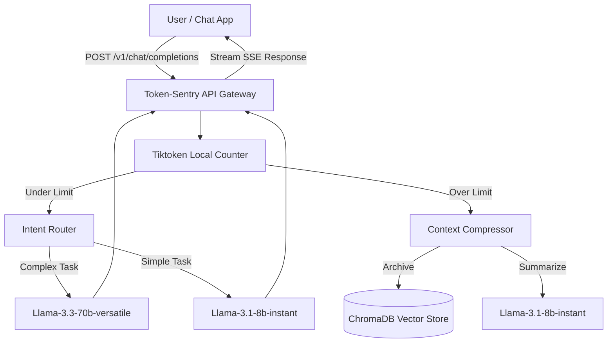

# 🛡️ Token-Sentry

**Token-Sentry** is an intelligent, high-performance, drop-in replacement API Gateway for Large Language Models (LLMs). It intercepts standard OpenAI-compatible chat requests and drastically reduces token usage and costs by providing **Infinite Context Memory** using a combination of dynamic summarization, semantic vector search, and intent-based routing.

Built for production on a blazing-fast local stack (Groq, ChromaDB, Redis) allowing you to use Llama models with OpenAI SDK compatibility.

---

## ✨ Features

- 💸 **Token Compression (Warm Memory):** Automatically intercepts long conversations that breach a set token limit (e.g., 4000 tokens) and compresses the older context into a lightweight JSON "summary card" using a cheaper model (Llama-3.1-8b-instant).
- 🧠 **Infinite Context (Cold Memory):** Archival memories are converted into vector embeddings and stored in a Vector Database (ChromaDB). When users ask about past topics, Token-Sentry dynamically retrieves and injects the exact memories via semantic search.
- 🚦 **Intent-Based Routing:** Not every prompt needs an expensive model. Token-Sentry intercepts requests like "Hello" or "What's up?" and routes them to a cheap/fast model, reserving the expensive reasoning model (Llama-3.3-70b-versatile) for complex coding and logic tasks.
- ⚡ **Zero-Latency Streaming:** Designed with true ASYNC Python and FastAPI, the proxy streams words back to the user instantly while handling complex memory management entirely in background tasks.
- 🔌 **100% OpenAI Compatible:** Works out of the box with any existing OpenAI SDK client. Just change the `base_url` to Token-Sentry.

---

## 🏗️ Architecture



---

## 🚀 Getting Started

### 1. Prerequisites
- **Docker** and **Docker Compose** installed.
- A **Groq API Key** from [Console Groq](https://console.groq.com/keys).

### 2. Installation
Clone the repository and set up your environment variables.

```bash
git clone https://github.com/SayantanBong007/Token-Sentry.git
cd Token-Sentry

# Copy the example environment file
cp .env.example .env
```

Open `.env` and configure your keys:
```env
# Get your free key at: https://console.groq.com/keys
GROQ_API_KEY=your-groq-api-key-here

# Token Watermarks
TOKEN_HIGH_WATERMARK=4000
TOKEN_BUFFER=500

# Redis Config (Session Store)
REDIS_HOST=redis
REDIS_PORT=6379
```

### 3. Run the Stack
Start Token-Sentry, Redis, and the Vector Database completely locally using Docker Compose:

```bash
docker-compose up --build -d
```
The gateway is now running at `http://localhost:8000`.

---

## 💻 How to Use It (Client Side)

Token-Sentry acts exactly like the standard OpenAI API. You do not need to rewrite your client application; simply point your OpenAI SDK to `http://localhost:8000/v1`.

### Python Example
```python
from openai import OpenAI

# 1. Point the client to Token-Sentry instead of OpenAI
client = OpenAI(
    base_url="http://localhost:8000/v1",
    api_key="not-needed" # Token-Sentry handles authentication upstream
)

# 2. Add an X-Session-ID to maintain infinite memory across calls
response = client.chat.completions.create(
    model="llama-3.3-70b-versatile",
    messages=[{"role": "user", "content": "Write a python script to reverse a string."}],
    stream=True,
    extra_headers={
        "X-Session-ID": "user-session-123"
    }
)

# 3. Stream the output just like normal!
for chunk in response:
    print(chunk.choices[0].delta.content or "", end="")
```

### cURL Example
```bash
curl -X POST http://localhost:8000/v1/chat/completions \
  -H "Content-Type: application/json" \
  -H "X-Session-ID: my-test-session" \
  -d '{
    "model": "llama-3.3-70b-versatile",
    "messages": [{"role": "user", "content": "Hello, how are you?"}],
    "stream": true
  }'
```

---

## 🗄️ Monitoring & Logs
You can monitor the live token savings, intent classification, and memory compression by watching the Docker logs:
```bash
docker-compose logs -f app
```
*(Look out for the 🔴 Watermark Breached events to see the compression in action!)*

---

## 🤖 AI Agent Skill (For Cursor, Antigravity, etc.)

I have included an **AI Agent Skill** in this repository. You can give this skill to your AI coding assistant so that it automatically knows how to write code that integrates with Token-Sentry!

To use it:
1. Locate the `skills/token-sentry/SKILL.md` file in this repository.
2. Copy it into your global AI customization folder (e.g. `~/.gemini/config/skills/token-sentry/SKILL.md` for Antigravity) or paste its contents into your `.cursorrules` file.
3. Simply tell your AI: *"Write a Python script that talks to Llama-3, and route it through Token-Sentry."* — It will automatically write the correct `base_url` overrides and handle the headers for you!
